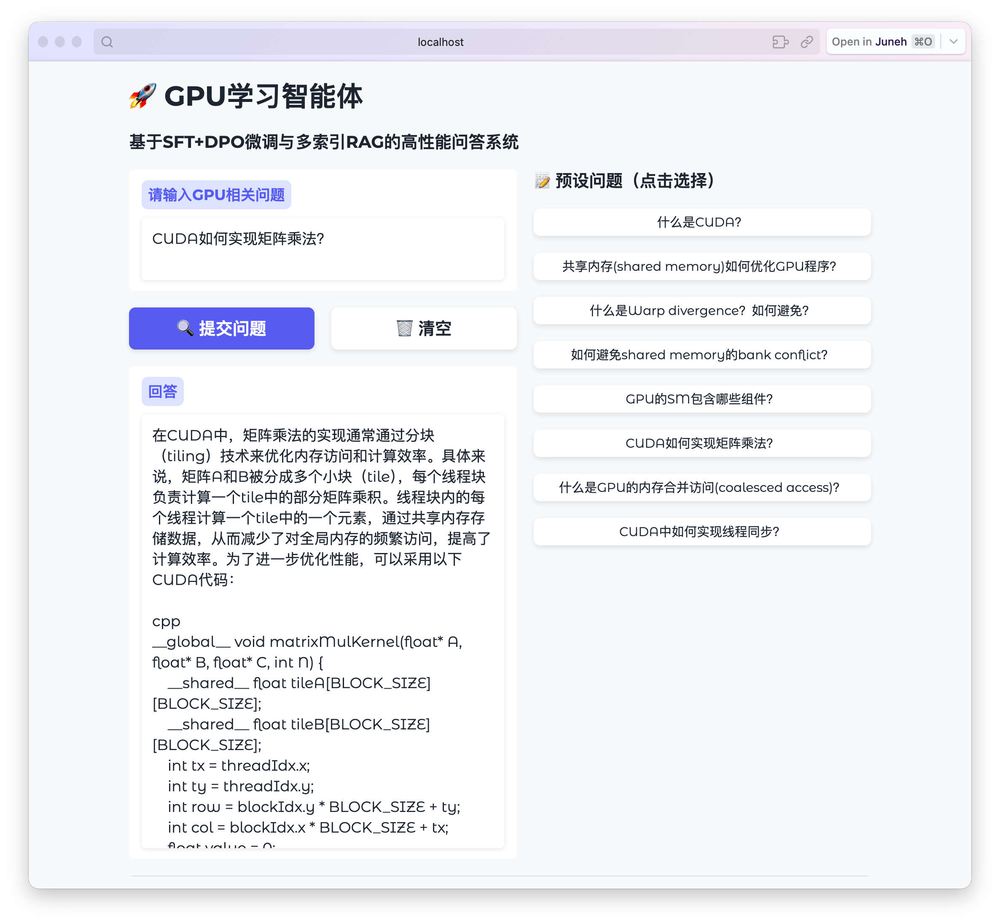

# 🚀 GPU-Tutor

2025年秋季国科大《GPU架构与编程》

A high-performance intelligent Q&A system for GPU architecture and programming, based on SFT+DPO fine-tuning and multi-index RAG.

[](https://www.python.org/)
[](https://github.com/vllm-project/vllm)
[](https://opensource.org/licenses/Apache-2.0)

## 📊 Performance

| Metric | Score |
|--------|-------|
| Accuracy (ROUGE-L) | **0.3733** |
| Inference Speed | **33529.45 chars/s** |

## 🏗️ Architecture

```
                        ┌─────────────┐
                        │  User Query │
                        └──────┬──────┘
                               ▼
              ┌────────────────────────────────┐
              │     Multi-Index RAG System     │
              │  ┌────────┐  ┌────────┐        │
              │  │rag_qna │  │rag_cuda│        │
              │  └────────┘  └────────┘        │
              │  ┌─────────┐  ┌────────────┐   │
              │  │rag_triton│ │rag_advanced│   │
              │  └─────────┘  └────────────┘   │
              │     GPU FAISS + Smart Router   │
              └────────────────┬───────────────┘
                               ▼
              ┌────────────────────────────────┐
              │     Qwen3-0.6B (SFT + DPO)     │
              │        vLLM Inference          │
              └────────────────┬───────────────┘
                               ▼
                        ┌─────────────┐
                        │   Answer    │
                        └─────────────┘
```

## ✨ Features

- **Two-Stage Fine-tuning**: SFT for knowledge injection + DPO for output alignment
- **Multi-Index RAG**: 4 specialized knowledge bases with intelligent routing
- **High-Performance Inference**: vLLM with continuous batching and prefix caching
- **GPU-Accelerated Retrieval**: FAISS GPU index for fast vector search
- **Embedding Cache**: Pre-computed embeddings for common queries

## 🛠️ Tech Stack

| Component | Technology |
|-----------|------------|
| Base Model | Qwen3-0.6B |
| Fine-tuning | Unsloth (LoRA) |
| Inference | vLLM |
| Embedding | BGE-small-zh-v1.5 |
| Vector DB | FAISS |
| API | FastAPI |

## 📁 Project Structure

```
GPU-Tutor/
├── serve.py                 # Main inference server
├── finetune_unsloth.py      # SFT fine-tuning script
├── dpo_unsloth.py           # DPO alignment script
├── rag_build.py             # RAG index builder
├── demo_ui.py               # Gradio demo interface
├── download_model.py        # Model downloader
├── Dockerfile               # Docker deployment
├── requirements.txt         # Dependencies
├── data/                    # Training data
│   ├── processed_dataset_converted.json
│   └── ...
├── rag_indexes/             # RAG indexes
│   ├── rag_qna/
│   ├── rag_cuda/
│   ├── rag_triton/
│   └── rag_advanced/
└── finetune_data/           # Fine-tuning data
    ├── train_sft_bonus_gt.json
    └── dpo_data.json
```

## 🚀 Quick Start

### 1. Install Dependencies

```bash
pip install -r requirements.txt

# For fine-tuning
pip install unsloth
```

### 2. Download Models

```bash
python download_model.py
```

### 3. Start the Server

```bash
uvicorn serve:app --host 0.0.0.0 --port 8000
```

### 4. Test the API

```bash
curl -X POST http://localhost:8000/predict \
  -H "Content-Type: application/json" \
  -d '{"prompt": "What is CUDA shared memory?"}'
```

## 🐳 Docker Deployment (Recommeded)

```bash
# pull vLLM image
docker pull vllm/vllm-openai@sha256:6766ce0c459e24b76f3e9ba14ffc0442131ef4248c904efdcbf0d89e38be01fe

# Build image
docker build -t gpu-tutor .

# Run container
docker run --gpus all -p 8000:8000 --name gpu-test gpu-tutor

# start UI
python demo_ui.py

# Clean Docker image and container
docker stop gpu-test
docker rm gpu-test
docker rmi gpu-tutor
```

## 🎯 Fine-tuning

### Stage 1: SFT (Supervised Fine-Tuning)

```bash
python finetune_unsloth.py --train
```

**Configuration:**
```python
LORA_R = 64
LORA_ALPHA = 128
EPOCHS = 3
LEARNING_RATE = 2e-4
```

### Stage 2: DPO (Direct Preference Optimization)

```bash
# Prepare preference data
python dpo_unsloth.py --prepare

# Train
python dpo_unsloth.py --train
```

**Configuration:**
```python
BETA = 0.1
LEARNING_RATE = 5e-6
EPOCHS = 1
```

## 📚 RAG System

### Knowledge Bases

| Index | Content | Chunks |
|-------|---------|--------|
| rag_qna | Course Q&A pairs | ~8,000 |
| rag_cuda | CUDA documentation | ~3,000 |
| rag_triton | Triton tutorials | ~100 |
| rag_advanced | TileLang/PTX docs | ~1,000 |

### Build RAG Indexes

```bash
python rag_build.py --build
```

### Smart Routing

The system automatically routes queries to relevant indexes:

```python
"What is triton?"      → rag_triton
"CUDA shared memory"   → rag_cuda
"TileLang tutorial"    → rag_advanced
Default                → rag_qna
```

## 🎨 Demo Interface



```bash
# Start backend
python serve.py
# or  
uvicorn serve:app --host 0.0.0.0 --port 8000

# Start frontend (in another terminal)
python demo_ui.py

# Open browser: http://localhost:7860
```

## ✍️ Test
```bash
python generate_predictions_batch.py -d ./path/to/your/json
# ROUGE-L accuracy
python evaluate_local.py
```


## ⚡ Optimization Details

### Why No Quantization?

| Config | Accuracy | Speed | Conclusion |
|--------|----------|-------|------------|
| FP16 | 0.38 | 33,000 c/s | ✅ Best |
| W4A16 | 0.35 | 20,000 c/s | ❌ Both decreased |

For small models (0.6B), quantization overhead outweighs benefits.

### vLLM Optimizations

```python
GPU_MEMORY_UTILIZATION = 0.88
MAX_MODEL_LEN = 2048
enable_prefix_caching = True
enable_chunked_prefill = True
max_num_batched_tokens = 32768
```

### RAG Optimizations

- **GPU FAISS**: 10x faster retrieval
- **Embedding Cache**: Pre-computed common queries
- **Similarity Threshold**: 0.75 to filter low-quality results
- **Context Length**: Limited to 200 chars for speed

## 📈 Performance Evolution

### Accuracy Improvement

| Stage | Accuracy | Improvement |
|-------|----------|-------------|
| Base Model | 0.15 | - |
| + SFT | 0.28 | +87% |
| + RAG | 0.37 | +25% |
| + DPO | **0.38** | +9% |

### Speed Improvement

| Stage | Speed (c/s) | Improvement |
|-------|-------------|-------------|
| Baseline | 16,624 | - |
| + vLLM Optimization | 22,973 | +38% |
| + RAG Optimization | 26,458 | +15% |
| + Full Pipeline | **33529.45** | +25% |

## 🔧 Configuration

Key configurations in `serve.py`:

```python
class Config:
    MODEL_PATH = "./local-model"
    
    # RAG
    USE_RAG = True
    RAG_TOP_K = 1
    RAG_CONTEXT_MAX_LEN = 200
    RAG_SCORE_THRESHOLD = 0.75
    
    # vLLM
    GPU_MEMORY_UTILIZATION = 0.88
    MAX_MODEL_LEN = 2048
    MAX_TOKENS = 512
```

## 📝 API Reference

### POST /predict

**Request:**
```json
{
  "prompt": "What is CUDA?"
}
```

**Batch Request:**
```json
{
  "prompt": ["What is CUDA?", "What is shared memory?"]
}
```

**Response:**
```json
{
  "response": "CUDA is NVIDIA's parallel computing platform..."
}
```

### GET /rag/info

Returns RAG system information.

### GET /rag/test?query=xxx&top_k=5

Test RAG retrieval with a query.

## 🤝 Contributing

Contributions are welcome! Please feel free to submit a Pull Request.

## 📄 License

This project is licensed under the MIT License - see the [LICENSE](LICENSE) file for details.

## 🙏 Acknowledgments

- [Qwen](https://github.com/QwenLM/Qwen) - Base model
- [vLLM](https://github.com/vllm-project/vllm) - High-performance inference
- [Unsloth](https://github.com/unslothai/unsloth) - Efficient fine-tuning
- [FAISS](https://github.com/facebookresearch/faiss) - Vector similarity search

## 📧 Contact

For questions or issues, please open an issue on GitHub.

---

**Made with ❤️ for GPU and MLSys**